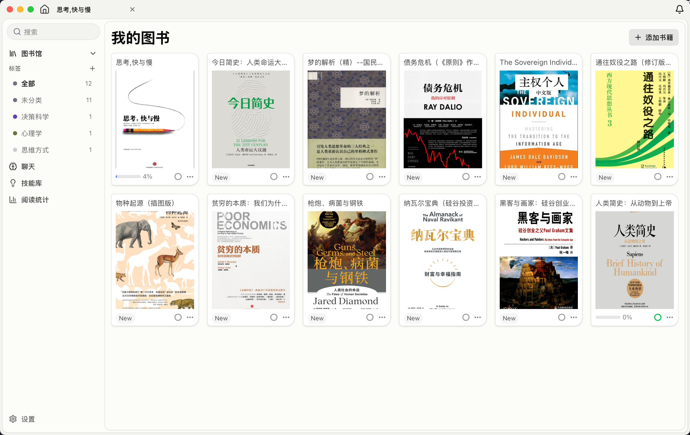
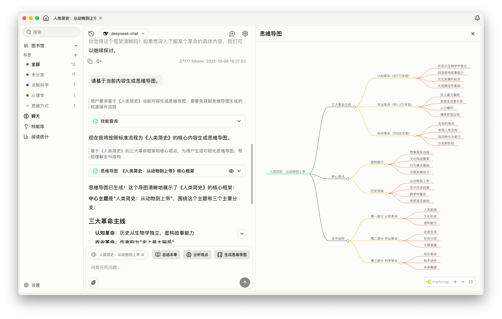

# SageRead

**一款支持 AI 对话的电子书阅读器**

  

 

SageRead 是一款电子书阅读器，主要特点是可以在阅读时随时跟 AI 对话。

你可以用它来读电子书，做笔记和高亮标注。不懂的地方直接问 AI，它会根据书籍内容给你解答。支持自定义 AI 提示词，可以让 AI 帮你总结、翻译或做其他事情。所有数据都存在本地，支持自己配置 AI 服务。

---

## ✨ 核心特性

| Feature | Description | Status |
| :--- | :--- | :---: |
| 📖 **智能阅读器** | 支持 EPUB 格式，提供流畅的阅读体验，支持滚动和分页两种阅读模式 | ✅ |
| 🤖 **AI 对话助手** | 阅读时随时提问，AI 实时理解书籍内容并提供深度解答和分析 | ✅ |
| ✍️ **笔记标注系统** | 支持高亮标注、书签管理、文本摘录，所有笔记永久保存本地 | ✅ |
| 📊 **阅读统计分析** | 可视化阅读数据，追踪阅读习惯、进度和时长统计 | ✅ |
| 🎯 **自定义技能** | 创建个性化 AI 提示词模板，打造专属阅读工作流 | ✅ |
| 🔍 **全文搜索** | 快速搜索书籍内容，精准定位关键章节和段落 | ✅ |
| 🔊 **TTS 朗读** | 内置文字转语音功能，支持多语言朗读，解放双眼 | ✅ |
| 🎨 **主题定制** | 深色/浅色主题切换，自定义字体、布局和配色方案 | ✅ |
| 🔒 **隐私优先** | 所有数据本地存储，支持自部署 AI 模型，保护阅读隐私 | ✅ |

---

## 🎬 功能展示

---

## 使用引导

**1. 配置 AI 模型**

在设置页面配置你的 AI 服务：

- 打开 **设置 → 模型提供商**
- 填写 API Key、Base URL 和模型名称
- 支持 OpenAI、Anthropic、OpenRouter、DeepSeek 等多种模型

**2. 配置向量模型**

为了实现智能检索和语义搜索，需要配置向量化模型：

- 打开 **设置 → 向量模型配置**
- 选择并配置 Embedding 模型
- 支持本地模型（仅 MacOS 支持）和在线 API

**3. 开始向量化**

导入书籍后，进行向量化处理：

- 在图书库中选择书籍
- 点击 **开始向量化** 按钮
- 等待处理完成后即可使用 AI 对话功能