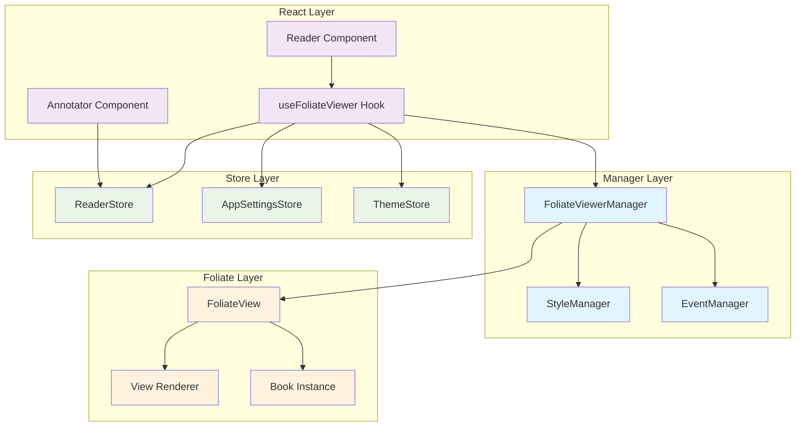
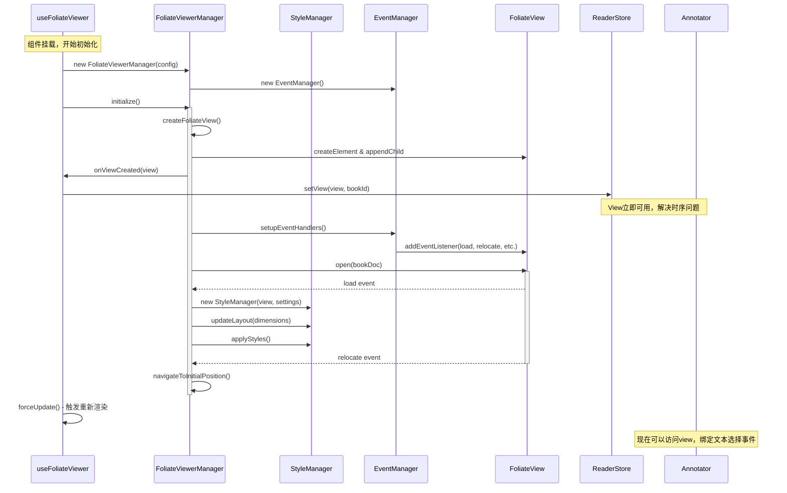
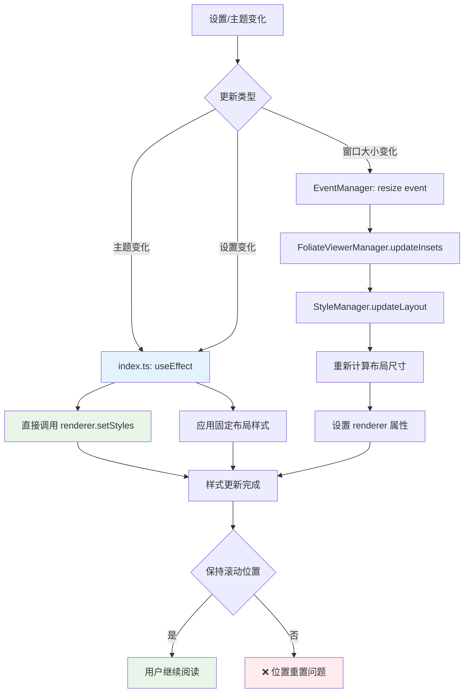
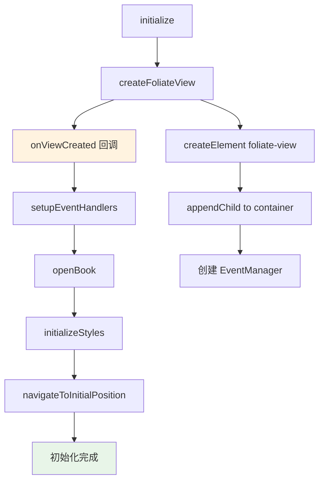
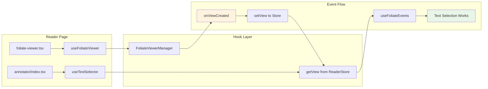

# use-foliate-viewer Hook 完整架构文档

## 🏗️ 架构概览

`use-foliate-viewer` 是一个高度模块化的 React Hook，用于管理 Foliate 电子书阅读器。经过完整重构后，采用了基于管理器模式的架构，将复杂的阅读器功能分离为独立的、可测试的模块。

### 核心设计原则

- **🎯 单一职责**：每个模块专注于特定功能领域
- **🔄 依赖注入**：通过构造函数注入依赖，提高解耦性
- **📡 事件驱动**：使用回调和事件机制处理异步操作
- **⚡ 性能优化**：防抖更新、轻量级样式变更、智能布局计算
- **🛡️ 错误恢复**：完善的错误处理和资源清理机制

## 📊 架构关系图



## 🔄 初始化状态流转图



## 📱 运行时更新流转图



## 📁 文件架构详解

### 1. **index.ts** - 主入口控制器

**核心职责**：
- 作为 React Hook 的主入口点
- 管理整个 Hook 的生命周期
- 协调各个管理器的初始化和更新
- 处理轻量级的样式更新（避免位置重置）

**关键特性**：
```typescript
// 单次初始化模式
const isInitialized = useRef(false);
useEffect(() => {
  if (isInitialized.current || !containerRef.current) return;
  isInitialized.current = true;
  // ... 初始化逻辑
}, []); // 空依赖数组，只运行一次

// 轻量级样式更新（不重置滚动位置）
useEffect(() => {
  const view = managerRef.current?.getView();
  if (view?.renderer && isInitialized.current) {
    const styles = getStyles(settings.globalViewSettings, themeCode);
    view.renderer.setStyles?.(styles); // 直接设置样式
  }
}, [themeCode, isDarkMode, settings.globalViewSettings]);
```

**API 接口**：
```typescript
export const useFoliateViewer = (
  bookId: string,
  bookDoc: BookDoc,
  config: BookConfig,
  insets: Insets
) => ({
  containerRef: React.RefObject<HTMLDivElement>,
  mouseHandlers: MouseEventHandlers,
  refresh: () => Promise<void>,
  getView: () => FoliateView | null
})
```

### 2. **FoliateViewerManager.ts** - 核心协调器

**核心职责**：
- 管理 FoliateView 的完整生命周期
- 协调 StyleManager 和 EventManager
- 处理书籍打开、导航、进度跟踪
- 提供统一的配置更新接口

**初始化流程**：


**关键方法**：
```typescript
class FoliateViewerManager {
  async initialize(): Promise<void>
  destroy(): void
  
  // 配置更新（避免重置滚动位置）
  updateViewSettings(settings: Partial<ViewSettings>): void
  updateTheme(themeCode: ThemeCode, isDarkMode: boolean): void
  updateInsets(insets: InsetsConfig): void
  
  // 回调设置（解决时序问题）
  setProgressCallback(callback: ProgressUpdateCallback): void
  setViewSettingsCallback(callback: ViewSettingsUpdateCallback): void
  
  // 视图访问
  getView(): FoliateView | null
}
```

**容器尺寸处理**：
```typescript
private getContainerDimensions(): LayoutDimensions {
  const { container, insets } = this.config;
  const rect = container.getBoundingClientRect();
  let dimensions = {
    width: rect.width - insets.left - insets.right,
    height: rect.height - insets.top - insets.bottom,
  };
  
  // 🔧 备用逻辑：容器未完全渲染时使用窗口尺寸
  if (dimensions.width <= 0 || dimensions.height <= 0) {
    dimensions = {
      width: Math.max(window.innerWidth - insets.left - insets.right, 720),
      height: Math.max(window.innerHeight - insets.top - insets.bottom, 800),
    };
  }
  
  return dimensions;
}
```

### 3. **StyleManager.ts** - 智能样式管理器

**核心职责**：
- 管理阅读器的样式和布局设置
- 智能计算布局尺寸（解决宽度占满问题）
- 提供防抖的样式更新机制
- 处理主题变化和响应式布局

**布局计算优化**：
```typescript
private calculateLayout(dimensions: LayoutDimensions): {
  maxColumnCount: number;
  maxInlineSize: number;
  maxBlockSize: number; // 🆕 新增基于容器的 block size
} {
  const isVertical = !!this.currentSettings.vertical;
  const containerSize = isVertical ? dimensions.height : dimensions.width;
  const blockSize = isVertical ? dimensions.width : dimensions.height;
  
  // 🔧 修复：基于实际容器尺寸而非硬编码
  let computedMaxBlockSize = this.currentSettings.maxBlockSize || 
                             Math.max(blockSize, 1440);
  
  // 🔧 优化：滚动模式使用全宽度
  if (this.currentSettings.scrolled) {
    computedMaxInlineSize = Math.max(containerSize, 720);
  } else {
    if (columnMode === "one") {
      computedMaxInlineSize = Math.max(containerSize, 720); // 单栏全宽
    } else if (columnMode === "two") {
      const target = Math.floor(containerSize / 2 - gapPx);
      computedMaxInlineSize = Math.max(320, target); // 提升最小宽度
    }
  }
  
  return { maxColumnCount, maxInlineSize, maxBlockSize };
}
```

**防抖更新机制**：
```typescript
applyStyles(): void {
  const now = Date.now();
  if (now - this.lastUpdateTime < 50) { // 50ms 防抖
    if (this.updateDebounceTimer) clearTimeout(this.updateDebounceTimer);
    this.updateDebounceTimer = setTimeout(() => this.doApplyStyles(), 50);
    return;
  }
  
  this.doApplyStyles();
  this.lastUpdateTime = now;
}
```

### 4. **EventManager.ts** - 统一事件管理器

**核心职责**：
- 统一管理所有事件监听器的生命周期
- 处理 Foliate 特定事件和全局事件
- 提供类型安全的事件处理机制
- 确保事件监听器的完整清理（避免内存泄漏）

**事件类型映射**：
```typescript
// Foliate 特定事件
setupFoliateEventHandlers(handlers: {
  onLoad?: (event: CustomEvent) => void,          // 页面加载完成
  onRelocate?: (event: CustomEvent) => void,      // 位置变化
  onRendererRelocate?: (event: CustomEvent) => void, // 渲染器位置变化
}): void

// 全局系统事件
setupGlobalEventListeners(bookId: string, handlers: {
  onResize?: (bookIds: string[]) => void,         // 窗口大小变化
  onMessage?: (event: MessageEvent) => void,      // 跨窗口消息
}): void
```

**类型转换处理**：
```typescript
// 🔧 修复：正确处理 EventListener 到 CustomEvent 的类型转换
setupFoliateEventHandlers(handlers: EventHandlers): void {
  if (handlers.onLoad) {
    this.addEventListener('load', (event: Event) => {
      handlers.onLoad!(event as CustomEvent); // 安全的类型转换
    });
  }
}
```

## 🚀 最新优化和修复

### 1. 解决死循环问题 ✅

**问题**：useEffect 依赖项导致无限重新初始化
```typescript
// ❌ 问题代码
useEffect(() => {
  // 初始化逻辑
}, [bookId, bookDoc, config]); // 每次变化都重新初始化

// ✅ 修复后
const isInitialized = useRef(false);
useEffect(() => {
  if (isInitialized.current) return;
  isInitialized.current = true;
  // 初始化逻辑
}, []); // 只运行一次
```

### 2. 解决滚动位置重置 ✅

**问题**：设置更新时自动回到页面顶部
```typescript
// ❌ 问题代码：调用管理器方法触发布局重新计算
useEffect(() => {
  if (managerRef.current) {
    managerRef.current.updateViewSettings(settings); // 重置滚动位置
  }
}, [settings]);

// ✅ 修复后：直接更新样式，避免布局重新计算
useEffect(() => {
  const view = managerRef.current?.getView();
  if (view?.renderer) {
    view.renderer.setStyles?.(getStyles(settings, themeCode)); // 保持位置
  }
}, [settings, themeCode]);
```

### 3. 修复文本选择功能 ✅

**问题**：时序问题导致 annotation-popup 无法弹出
```typescript
// ❌ 问题：setView 在初始化完成后才调用
manager.initialize().then(() => {
  setView(view, bookId); // annotator 已经渲染，getView 返回 null
});

// ✅ 修复：在 view 创建后立即设置
const manager = new FoliateViewerManager({
  onViewCreated: (view) => {
    setView(view, bookId); // 立即可用
  }
});
```

### 4. 优化布局计算 ✅

**问题**：max-block-size 硬编码导致宽度不充分利用
```typescript
// ❌ 问题代码
renderer.setAttribute("max-block-size", "1000px"); // 硬编码

// ✅ 修复后：基于实际容器尺寸
const layout = calculateLayout(dimensions);
renderer.setAttribute("max-block-size", `${layout.maxBlockSize}px`);

// 🔧 布局策略优化
if (scrolled) {
  maxInlineSize = Math.max(containerSize, 720); // 滚动模式全宽
} else if (columnMode === 'one') {
  maxInlineSize = Math.max(containerSize, 720); // 单栏全宽
}
```

## 🔗 组件集成流程



## 📋 API 参考

### useFoliateViewer Hook

```typescript
const {
  containerRef,    // 容器引用，绑定到 div
  mouseHandlers,   // 鼠标事件处理器
  refresh,         // 手动刷新布局
  getView         // 获取当前 FoliateView 实例
} = useFoliateViewer(bookId, bookDoc, config, insets);
```

### FoliateViewerManager API

```typescript
// 生命周期
await manager.initialize();
manager.destroy();

// 配置更新
manager.updateViewSettings(partialSettings);
manager.updateTheme(themeCode, isDarkMode);
manager.updateInsets(newInsets);

// 回调设置
manager.setProgressCallback((progress, bookId) => {...});
manager.setViewSettingsCallback((settings) => {...});
```

## 🐛 调试和排错

### 常见问题

1. **文本选择无效**
   - 检查 `getView(bookId)` 是否返回有效实例
   - 确认 `useFoliateEvents` 正确绑定了 `onLoad` 事件

2. **布局显示异常**
   - 检查容器尺寸是否正确获取
   - 查看 console 中的布局计算日志

3. **滚动位置重置**
   - 确认使用的是轻量级样式更新
   - 避免调用 `updateLayout()` 等重型方法

### 调试开关

在开发环境中，系统会输出详细的调试信息：
```typescript
// 容器尺寸调试
console.log('Container dimensions:', { containerRect, insets, finalDimensions });

// 布局计算调试
console.log('Layout calculation:', { dimensions, settings, result });
```

## 🚀 性能优化策略

1. **初始化优化**
   - 单次初始化避免重复创建
   - 异步加载 foliate-js 模块
   - 容器尺寸备用机制

2. **更新优化**
   - 50ms 防抖样式更新
   - 轻量级样式变更路径
   - 避免不必要的布局重新计算

3. **内存管理**
   - 完善的事件监听器清理
   - 定时器和异步操作取消
   - 视图实例正确销毁

## 📈 未来改进方向

- [ ] 支持更多 Foliate 事件类型
- [ ] 添加完整的单元测试覆盖
- [ ] 实现性能监控和指标收集
- [ ] 支持插件化扩展机制
- [ ] 改进错误恢复和重试逻辑
- [ ] 优化首次加载性能

---

*本文档记录了 use-foliate-viewer Hook 的完整架构设计、实现细节和优化过程，为开发和维护提供全面的技术参考。*